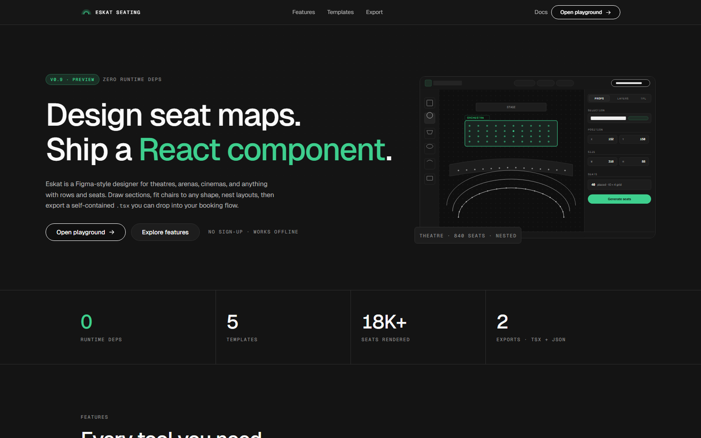
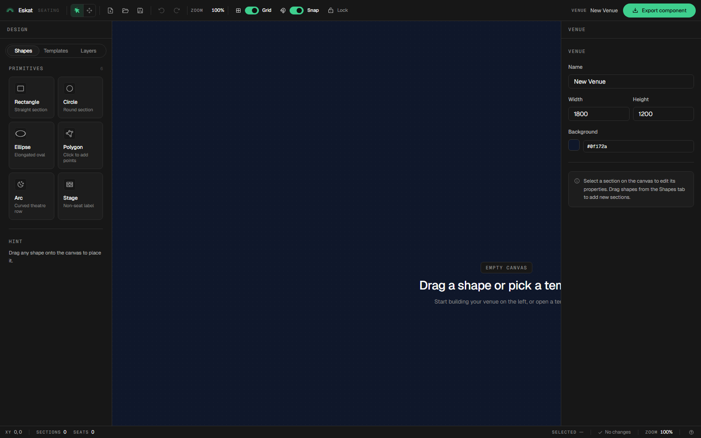
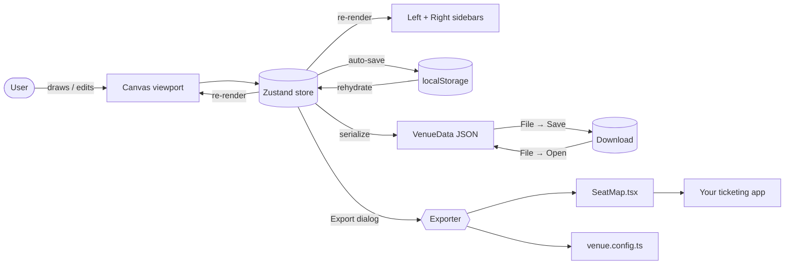
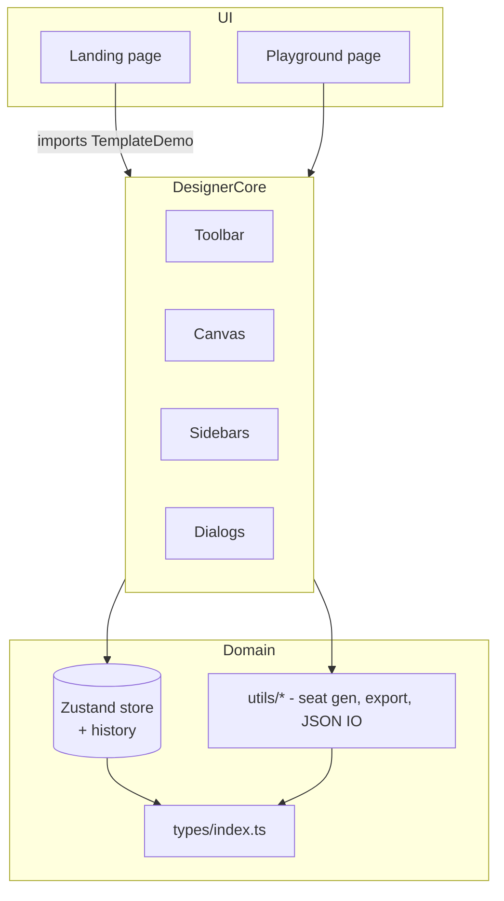

<div align="center">


# Eskat — Seating Design Tool

**A Figma-grade visual designer for building interactive seat maps.**
Draw venues, auto-generate seats, and export a zero-dependency React component you can drop straight into a ticketing page.

[](https://react.dev)
[](https://www.typescriptlang.org/)
[](https://vitejs.dev/)
[](https://bun.sh)
[](https://tailwindcss.com)
[](https://zustand-demo.pmnd.rs/)
[](#license)

<br />

<a href="#-quick-start"><strong>Get started →</strong></a> ·
<a href="#-live-demo--landing-page"><strong>See the demo</strong></a> ·
<a href="#-exported-component"><strong>Export API</strong></a> ·
<a href="#-keyboard-shortcuts"><strong>Shortcuts</strong></a>

<br />

<!-- Drop a hero screenshot of the playground at docs/screenshots/hero.png -->


</div>

---

## Table of Contents

- [Overview](#-overview)
- [Feature Highlights](#-feature-highlights)
- [Live Demo — Landing Page](#-live-demo--landing-page)
- [Screenshots](#-screenshots)
- [Quick Start](#-quick-start)
- [Tech Stack](#-tech-stack)
- [Project Structure](#-project-structure)
- [Core Concepts](#-core-concepts)
- [Playground Guide](#-playground-guide)
- [Templates](#-templates)
- [Exported Component](#-exported-component)
- [Keyboard Shortcuts](#-keyboard-shortcuts)
- [Architecture](#-architecture)
- [Development](#-development)
- [Roadmap](#-roadmap)
- [Contributing](#-contributing)
- [License](#license)

---

## Overview

Eskat is a browser-based design tool that treats a venue like a vector editor treats a canvas. Draw sections with rectangles, circles, ellipses, polygons and curved arcs, tune the seat generator per section, and round-trip the whole layout as JSON. When you are done, a single click produces a **self-contained `SeatMap.tsx`** — no npm install, no CSS framework, no runtime dependencies — that end-users can interact with to pick tickets.

> **Who is this for?**
> - Ticketing platforms that need bespoke venue maps per event.
> - Event organisers laying out conferences, cinemas, theatres, stadiums or arenas.
> - Engineering teams that want a visual editor **and** a clean React output, without locking data behind a SaaS.

<p align="center">
  
</p>

---

## Feature Highlights

<table>
<tr>
<td width="50%" valign="top">

### Canvas & Shapes
- Infinite canvas with smooth pan / zoom (`react-zoom-pan-pinch`)
- Grid, snap-to-grid, and live alignment guides
- **Rectangle, circle, ellipse, polygon, arc / curved rows, stage**
- Bezier edges — drag any polygon edge into a cubic curve
- Corner radius, pattern fills (dots, grid, stripes, custom SVG)
- Per-shape interaction rules: tooltip, click action, hover scale

</td>
<td width="50%" valign="top">

### Seats & Rows
- Auto-generator: grid mode for rectangles/polygons, concentric-arc mode for arc sections
- **Fit-to-shape** clipping so seats never spill past a section's silhouette
- Custom seat icons per section (sanitised SVG or PNG)
- States: `available`, `reserved`, `disabled`, `selected`, plus special-needs marker
- Delete single or multi-selected seats from bar / menu / sidebar / hotkey

</td>
</tr>
<tr>
<td width="50%" valign="top">

### Selection & Editing
- Multi-select sections via Shift-click and marquee
- Multi-seat selection: `Shift/Ctrl/Cmd + click`, `Alt + click` for a whole row, `Alt`-drag marquee
- Floating quick-action bar with rename, duplicate, rotate ±15°, scale ±10%, clear seats, delete
- Nested venues — promote any section to a container, drill in / out with `Esc`
- Breadcrumb navigation honours the active drill level

</td>
<td width="50%" valign="top">

### State & Persistence
- Zustand store with 50-snapshot undo / redo history
- `Ctrl/Cmd + Z` / `Ctrl/Cmd + Y` for undo / redo
- `Ctrl/Cmd + L` to lock / unlock the canvas
- localStorage auto-save (schema `v3`)
- JSON import / export, round-trippable `VenueData` format
- Five bundled templates regenerated from a single script

</td>
</tr>
<tr>
<td width="50%" valign="top">

### Export System
- One-click **Export → React Component**
- Ships a self-contained `SeatMap.tsx` — no deps
- Optional `venue.config.ts` sidecar for theming
- Supports nested drill-in, patterns, arcs, interactions and custom seat icons out of the box
- Tune colors, zoom range, marquee behaviour at the top of the exported file

</td>
<td width="50%" valign="top">

### Accessibility & UX
- ARIA labels on seats and sections, `role="application"` on the viewport
- Keyboard activation (Enter / Space), tab navigation, `Esc` for drill-up
- Dark-first UI with calibrated contrast
- Figma-style marquee and multi-select conventions

</td>
</tr>
</table>

---

## Live Demo — Landing Page

The landing page ships an interactive "shadcn-style" code window showcasing every bundled template as a realistic end-user seat-picker. It is the exact same component your clients would embed on a checkout page — just rendered at runtime with seeded random states so every section feels populated.

<p align="center">
  
</p>

What you can try from the landing page:

- **Template switcher** — swap between Theatre, Concert, Stadium, Arena and Cinema Complex
- **Seat-shape picker** — circle, rounded, square, chair, chair-simple (demo only; exported component is unaffected)
- **Range mode toggle** — click an anchor seat, hover any other seat, see the range preview, click to commit
- **Multi-select hotkeys** — Shift for range, `Ctrl`/`Cmd` for additive toggle, `Alt` for whole-row, drag for marquee
- **Live tooltip** with real `<kbd>` pills showing the right shortcut for the current modifier
- **Preview / Code tabs** — inspect the exported `.tsx` right next to the live component
- **Zoom controls locked to zoom-in + fit** so the demo window never goes out of bounds

> All demo-only features (seeded states, shape picker, range mode) are visual sugar on top of the runtime. The **exported component** keeps the original JSON states and its documented API.

---

## Screenshots

<p align="center">
  
  <br />
  <em>The playground — toolbar, left sidebar (shapes / templates / layers), canvas, right sidebar (property inspector).</em>
</p>

<p align="center">
  
  &nbsp;
  
  <br />
  <em>Seat generation dialog (left) and component export dialog (right).</em>
</p>

<p align="center">
  
  <br />
  <em>Nested venues — a cinema complex drills into a hall, a hall drills into seats. Breadcrumb at the top, <code>Esc</code> to go back.</em>
</p>

<p align="center">
  
  <br />
  <em>The five bundled templates: Concert, Stadium, Theatre, Arena and Cinema Complex.</em>
</p>

> **Adding your own screenshots**
> Create a `docs/screenshots/` folder at the repository root and drop PNGs with the filenames referenced above. The README will pick them up automatically on GitHub.

---

## Quick Start

```bash
# 1. Clone and install
git clone https://github.com/<your-user>/eskat-seating-tool.git
cd eskat-seating-tool
bun install

# 2. Start the dev server (http://localhost:5173)
bun dev

# 3. Open the landing page to see the demo, or jump straight to /playground
```

Also available:

```bash
bun run build      # Production build (tsc -b && vite build)
bun run preview    # Serve the production build locally
bun run lint       # ESLint across the repo
bun x tsc --noEmit -p tsconfig.app.json   # Type-check without emitting
```

> Prefer Node + npm/pnpm? Eskat is a standard Vite + React project, the `bun` commands map one-to-one to `npm run <script>`.

---

## Tech Stack

| Layer         | Choice                                                                 |
| ------------- | ---------------------------------------------------------------------- |
| Runtime       | [Bun](https://bun.sh) + [Vite 8](https://vitejs.dev/)                  |
| Framework     | React 19 with strict-mode TypeScript                                    |
| State         | [Zustand 5](https://zustand-demo.pmnd.rs/) with a 50-snapshot history  |
| Styling       | Tailwind CSS 3 + CSS variables (dark-first)                            |
| UI primitives | [shadcn/ui](https://ui.shadcn.com/) + Radix UI                          |
| Canvas        | `react-zoom-pan-pinch`                                                  |
| Icons         | [Phosphor Icons](https://phosphoricons.com/)                            |
| DnD           | `@dnd-kit/core` for layer reordering                                    |
| Toasts        | `sonner`                                                                |
| Routing       | `react-router-dom` v7                                                  |
| IDs           | `nanoid`                                                                |

---

## Project Structure

```
eskat-seating-tool/
├── public/
│   └── assets/logos/              Brand marks used throughout the UI
├── scripts/
│   └── buildTemplates.ts          Regenerates the 5 bundled templates
├── src/
│   ├── assets/icons/              Inline SVG icon library (chair, wheelchair, etc.)
│   ├── components/
│   │   ├── canvas/                Canvas viewport, sections, seats, context menus
│   │   ├── dialogs/               SeatGenerationDialog, ExportComponentDialog, ConfirmDialog
│   │   ├── landing/               Hero, TemplateDemo, CodePane, ShortcutGrid, …
│   │   ├── previews/              Shared template thumbnails
│   │   ├── sidebar/               Left (shapes / templates / layers) + right (inspector)
│   │   └── ui/                    shadcn/ui primitives
│   ├── hooks/                     useSnapToGrid, useAlignmentGuides, useKeyboardShortcuts, …
│   ├── layout/                    Toolbar, StatusBar
│   ├── pages/
│   │   ├── Landing.tsx            Marketing page with the interactive demo
│   │   └── Playground.tsx         The actual designer
│   ├── store/                     Zustand store with history
│   ├── templates/                 concert.json, stadium.json, theatre.json, arena.json, cinema-complex.json
│   ├── types/                     Shared TypeScript types
│   └── utils/                     Seat generation, JSON I/O, auto-save, exporter templates
└── index.html
```

---

## Core Concepts

### The `VenueData` schema

Every venue — whether loaded from a template, imported from JSON or round-tripped through localStorage — conforms to a single shape:

```ts
interface VenueData {
  version: '1.0';
  venue: {
    name: string;
    width: number;
    height: number;
    background: string;
  };
  sections: Section[];
  stage?: StageElement;
}
```

A `Section` can be rectangular, circular, elliptical, polygonal, arc-shaped, or a **container** holding child sections. Each section owns its seats, its seat-generation settings, its visual style (fill, stroke, pattern, custom icon), and its interaction rules. Full types live in [`src/types/index.ts`](src/types/index.ts).

### Sections vs. Containers vs. Seats

```
Venue
├─ Section  (rectangle / circle / arc / polygon)
│   └─ Seat, Seat, Seat, …
├─ Container  ← a Section promoted to hold children
│   ├─ Section
│   │   └─ Seat, Seat, …
│   └─ Section
│       └─ Seat, Seat, …
└─ StageElement (optional)
```

Containers unlock arbitrary depth. A cinema complex can nest halls, a stadium can nest stands, and `Esc` always drills one level back up.

### Seat states

| State        | Meaning                                                  |
| ------------ | -------------------------------------------------------- |
| `available`  | Free to pick                                             |
| `reserved`   | Already taken by someone else                            |
| `disabled`   | Not sellable (broken / house-kill / behind-a-pillar)     |
| `selected`   | Picked by the current end-user                            |
| `accessible` | Wheelchair / special-needs marker (visual only)          |

The designer writes these states into the JSON; the exported component lets you override them at mount time via `initialSeatStates`.

---

## Playground Guide

<p align="center">
  
</p>

**Toolbar** (top): undo / redo, save JSON, import JSON, lock canvas, export component, zoom controls, grid toggle.

**Left sidebar**:
- **Shapes tab** — drag a rectangle, circle, ellipse, polygon or arc onto the canvas; drop a stage element.
- **Templates tab** — one-click load of any bundled template, replacing the current venue (prompts first).
- **Layers tab** — tree view with reorder (DnD), visibility toggle, z-index control, drill-in indicators.

**Canvas** (center): scroll to zoom, hold `Space` + drag to pan, click a section to select, double-click a container to drill in.

**Right sidebar** — property inspector, reshaped per selection:
- Venue (name, size, background)
- Section (style, seats, interaction, pattern, custom icon, rotation, position)
- Seat / multi-seat (label, price, state, row, accessibility)
- Stage element

**Floating quick-actions bar** — appears on single-section selection with rename, duplicate, rotate ±15°, scale ±10%, clear seats, delete, plus an overflow menu for convert-to-container / enter / generate seats / properties.

### A typical workflow

1. Start from a template (Templates tab → e.g. *Theatre*).
2. Reshape or replace sections with the shape tools.
3. Select a section → **Generate Seats** → tune rows, columns, spacing, curvature, or **fit-to-shape** for polygonal sections.
4. Price-tier the rows, flag wheelchair rows, mark obstructed seats as `disabled`.
5. Optionally promote a section into a container and nest sub-sections inside it.
6. Use **Preview** to see the end-user view, then **Export → React Component** to download `SeatMap.tsx`.

---

## Templates

Eskat ships with five production-grade layouts, generated by [`scripts/buildTemplates.ts`](scripts/buildTemplates.ts):

| Template           | Typical use            | Highlights                                             |
| ------------------ | ---------------------- | ------------------------------------------------------ |
| **Theatre**         | Opera houses, drama    | Curved arc rows, stage element, fan seating            |
| **Concert**         | Arena shows, gigs      | Front stage + tiered arc sections with mixed depths    |
| **Stadium**        | Football, rugby         | Rectangular tribunes with side stands                  |
| **Arena**           | Indoor arenas          | Circular bowl with radial seating                      |
| **Cinema Complex** | Multiplexes            | Nested containers — drill from lobby into each hall    |

Regenerate all five at once:

```bash
bun scripts/buildTemplates.ts
```

Edit seat counts, radii, prices and colors in the script, then re-run to overwrite `src/templates/*.json`.

---

## Exported Component

After designing a venue, **Export → Export as React Component** produces two files:

- **`SeatMap.tsx`** — the self-contained component (React only, no other deps).
- **`venue.config.ts`** — optional sidecar for theming and interaction tuning.

### Drop-in usage

```tsx
import SeatMap from './components/SeatMap/SeatMap';

export default function BookingPage() {
  return (
    <div style={{ width: '100%', height: '100vh' }}>
      <SeatMap
        maxSelectable={6}
        onSelectionChange={(ids) => console.log('Selected seats:', ids)}
        onSeatSelect={(id, info) =>
          console.log(`Clicked ${info.sectionName} ${info.label} — ${info.currency}${info.price}`)
        }
      />
    </div>
  );
}
```

### Props

| Prop                 | Type                                                     | Default     | Notes                                                   |
| -------------------- | -------------------------------------------------------- | ----------- | ------------------------------------------------------- |
| `initialSeatStates`  | `Record<string, 'available' \| 'reserved' \| 'disabled'>` | `{}`        | Override per-seat state at mount time                   |
| `onSeatSelect`       | `(seatId, info) => void`                                 | —           | Fires each time a seat is clicked                       |
| `onSelectionChange`  | `(selectedIds: string[]) => void`                        | —           | Fires with the full selection array                     |
| `readOnly`           | `boolean`                                                | `false`     | Disable all interaction                                 |
| `maxSelectable`      | `number`                                                 | `Infinity`  | Cap how many seats can be picked at once                |
| `initialDrillPath`   | `string[]`                                               | `[]`        | Start the viewer already drilled into a nested path     |
| `onDrillIn`          | `(sectionId, path) => void`                              | —           | Fires whenever the viewer drills into a container       |
| `onDrillOut`         | `(path) => void`                                         | —           | Fires whenever the viewer drills up                     |
| `className`          | `string`                                                 | —           | Applied to the outer viewport                           |
| `style`              | `React.CSSProperties`                                    | —           | Inline styles on the viewport                           |

### Tuning the exported component

The top of every exported `SeatMap.tsx` exposes a single `SEAT_CONFIG` block. Edit it in place — no designer rebuild required.

```ts
const SEAT_CONFIG = {
  colors: {
    available: '#a855f7',
    reserved:  '#ef4444',
    disabled:  '#4b5563',
    selected:  '#f59e0b',
    background: '#0f172a',
    // …
  },
  interaction: {
    minZoom: 0.4,
    maxZoom: 4,
    wheelZoomSpeed: 0.0015,
    marqueeSelect: true,
    shiftMultiSelect: true,
    drillAnimationMs: 350,
    showBreadcrumb: true,
    allowEscapeToDrillUp: true,
    defaultContainerClick: 'drillIn',
  },
  layout: {
    seatIcon: 'chair',
    showSectionLabels: true,
    showPriceBadges: true,
  },
} as const;
```

---

## Keyboard Shortcuts

| Action                          | Shortcut                                          |
| ------------------------------- | ------------------------------------------------- |
| Undo                            | `Ctrl/Cmd + Z`                                    |
| Redo                            | `Ctrl/Cmd + Y` or `Ctrl/Cmd + Shift + Z`         |
| Save JSON                       | `Ctrl/Cmd + S`                                    |
| Select all sections             | `Ctrl/Cmd + A`                                    |
| Delete selection                | `Delete` / `Backspace`                            |
| Deselect                        | `Escape`                                          |
| Lock / unlock canvas            | `Ctrl/Cmd + L`                                    |
| Scale selection up / down 10%   | `Ctrl/Cmd + Shift + =` / `Ctrl/Cmd + Shift + -`   |
| Pan canvas                      | Hold `Space` + drag                               |
| Multi-select sections           | `Shift` + click / drag                            |
| Toggle seat in selection        | `Shift` / `Ctrl` / `Cmd` + click a seat           |
| Select whole seat row           | `Alt` + click a seat                              |
| Marquee-select seats            | `Alt` + drag on canvas                            |
| Range-select seats (demo)       | Click anchor → hover → click to commit, or `Shift`+click |
| Finish polygon                  | `Enter` or double-click                           |
| Cancel polygon                  | `Escape`                                          |
| Enter container                 | Double-click a container                          |
| Drill up one level              | `Escape` (when drilled in)                        |

A complete reference is available in-app under the **Shortcuts** panel on the landing page.

---

## Architecture

### Data flow



### Module boundaries



---

## Development

### Requirements

- Node 20+ **or** [Bun](https://bun.sh) (recommended)
- A modern evergreen browser (Chrome, Firefox, Safari, Edge)

### Scripts

| Script               | What it does                                          |
| -------------------- | ----------------------------------------------------- |
| `bun dev`            | Vite dev server at `http://localhost:5173`            |
| `bun run build`      | Type-check (`tsc -b`) + production `vite build`       |
| `bun run preview`    | Serve the production build locally                    |
| `bun run lint`       | ESLint across the repo                                |
| `bun x tsc --noEmit` | Type-check only, no emit                              |

### Conventions

- **Strict TypeScript** everywhere — no `any` in domain code.
- **Zustand slices** are kept flat; mutations go through named actions.
- **Utils** are pure and side-effect free (seat generation, export templating, JSON IO).
- **Components under `canvas/`** may read the store directly; everything else takes props.
- **Keyboard shortcuts** live in `hooks/useKeyboardShortcuts.ts` — add new ones there so they remain discoverable.

---

## Roadmap

- [ ] Collaborative editing (Yjs / Liveblocks adapter)
- [ ] SVG / PNG export of the flattened venue map
- [ ] Price-tier heatmap overlay in the designer
- [ ] Headless CLI for batch-generating venues from JSON specs
- [ ] Exporter variants for Vue and Svelte
- [ ] i18n for the designer UI

Have an idea? Open a discussion or a PR.

---

## Contributing

Contributions are very welcome. The recommended flow:

1. **Fork** the repo and clone your fork.
2. Install dependencies with `bun install`.
3. Run `bun dev` and open the landing page / playground.
4. Create a feature branch: `git checkout -b feat/<short-name>`.
5. Before opening a PR, make sure **both** of these pass:
   ```bash
   bun run lint
   bun x tsc --noEmit -p tsconfig.app.json
   ```
6. Include a short screenshot or clip in the PR description when you change anything visual.

If you are touching the exported component, please test the output by:

1. Designing a small venue with nested containers.
2. Exporting it.
3. Dropping both files into a fresh Vite + React app.
4. Confirming selection, drill-in, and keyboard interactions still work.

---

## License

Released under the [MIT License](LICENSE). You are free to use Eskat and any components it exports in commercial products.

---

<div align="center">

<sub>Built with ❤️ on top of React, TypeScript, Vite, Tailwind and shadcn/ui.</sub>

</div>
