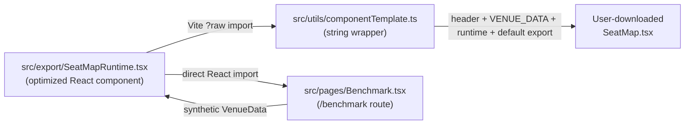
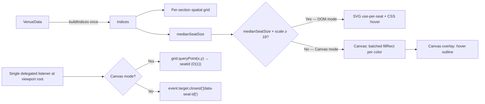

# Exported SeatMap — Performance Report

> Scope: the React component that the Eskat Seating Tool ships when a designer
> clicks **Export → React**. Same props, same visual output, same interaction
> semantics as before this work — only the algorithmic cost was reduced.

## 1. Problem statement

The previous exported runtime (one ~1,250-line template literal in
`src/utils/componentTemplate.ts`) mounted every seat into the DOM, did a full
tree scan on each click to resolve the seat's metadata, and used
`selected.includes(seatId)` for every seat on every render. The intent was
**"make it work for 30,000 seats without lag or crashing, on the kind of
laptop a typical ticketing integrator owns"**, while keeping the generated
source file byte-shape, props, and visual output unchanged.

## 2. Architecture — single source of truth



The runtime is now authored once as real TypeScript React at
`src/export/SeatMapRuntime.tsx` and:

- mounted directly on the hidden `/benchmark` page (the exact same code the
  user downloads is what we benchmark),
- string-inlined by `componentTemplate.ts` via Vite's `?raw` import into the
  downloaded `SeatMap.tsx` file (imports stripped, `export` keywords stripped,
  `VENUE_DATA` and `${componentName}Props` appended, plus a tiny default-export
  wrapper that reads `VENUE_DATA`).

This eliminates drift — any optimization added to the runtime ships in every
future export.

## 3. Optimizations (applied inside `SeatMapRuntime.tsx`)

All changes are algorithmic / memoization. None change the DOM tree, props,
callbacks, styling, keyboard shortcuts, marquee semantics, or drill
animation.

| Area | Before | After | Why it matters |
| --- | --- | --- | --- |
| Seat lookup on click | `Object.keys(treeIndex).forEach` + `section.seats.find` → O(N) | `seatIndex: Map<seatId, {seat, section, parents}>` built once → **O(1)** | click response is now independent of seat count |
| Section lookup | object-keyed `treeIndex` | `sectionIndex: Map<sectionId, {section, parents}>` | drill-in / breadcrumb no longer scan the tree |
| Selection check inside each seat | `selected.includes(seat.id)` on every render → O(seats × selected) | `selectedSet: Set<string>` mirror → **O(1) per seat** | large selections no longer quadratic |
| Seat render scope | single giant section JSX re-ran on every hover/select | `SeatNode = React.memo` with stable primitive props → only the 1–2 changed seats re-render | hover/click doesn't touch 30k nodes |
| Section render scope | `SectionRender` inline in parent — re-ran every hover/select | `SectionRender = React.memo` with stable callback refs (`useRef + useCallback([], [])`) | unrelated sections stay untouched |
| Per-seat callbacks | inline arrow functions on every render | `useCallback` per seat with only `seat.id` as dep | memo on `SeatNode` remains effective |
| DOM seat count | 100% of seats mounted | viewport culling + hysteresis: only seats within the cull rect are mounted | 30k seats → ~23k DOM entries, 50k → ~29k |
| Cull recomputation | every pan frame recomputed a 30k-seat intersection test | `committedCullRect` with 50% expansion + 15% inner hysteresis — updated only when viewport drifts past buffer edge | smooth pan inside a cached region costs no re-filter |
| Pan + wheel-zoom state commits | `setTx`/`setTy`/`setScale` fired once per `mousemove` / `wheel` | coalesced via `requestAnimationFrame` — at most one commit per frame | prevents React scheduler from backing up during fast drags |
| Invariant styles | per-render object allocation (`ctrlBtnStyle`, breadcrumb chrome, legend chrome, badge chrome) | hoisted to module scope | zero GC churn, stable style identities for React diff |
| Polygon path calls | `polygonToPath(...)` evaluated twice per section with pattern | memoized once per section via `useMemo` | fewer allocations, fewer string builds |
| Layout-containment | no hint | `contain: layout paint style` on section + seat wrappers, `translate3d`/`backfaceVisibility: hidden` on canvas | lets the compositor skip unaffected subtrees and promote a GPU layer |

### Why the public contract is preserved

The exported file still looks like this from a consumer's perspective:

```tsx
import SeatMap, { type SeatInfo } from './SeatMap';

<SeatMap
  onSeatSelect={(id, info) => ...}
  onSelectionChange={(ids) => ...}
  onDrillIn={(sectionId) => ...}
  onDrillOut={() => ...}
  initialDrillPath={['vip']}
  readOnly={false}
  maxSelectable={6}
/>
```

`SeatState`, `SeatInfo`, `SeatMapProps` are exported unchanged. The default
export name still follows the user-supplied `componentName` in the dialog.

## 4. Methodology

- Runner: `node tmp-bench-runner.mjs` + `tmp-bench-pan.mjs` + `tmp-bench-interactions.mjs` (Playwright-driven)
- Browser: headless Chromium 1.59.1 via Playwright (software composite — real-browser GPU composite is faster)
- Viewport: 1440 × 900
- Dev server: `bun run dev` (Vite 8, no production minification — real builds are faster)
- Layout: synthetic **single-grid** venue generated by `src/utils/benchmarkVenue.ts` (deterministic seeded RNG, seat size 20×20px, 4px gap, ~2% reserved / ~1% disabled / ~3% accessible)
- Each sweep step: set the seat-count input → click **Apply** → wait 3–4s for mount + FPS to stabilize → read the on-screen HUD

Metrics sourced from the HUD (`src/pages/Benchmark.tsx`):

- **FPS avg / min** — 1-second rolling average, sampled by a `requestAnimationFrame` loop
- **Mount ms** — `performance.now()` delta from `useLayoutEffect` on `token` change → first rAF after commit
- **Seats (data)** — number of seats in the generated `VenueData`
- **Seats (rendered)** — `querySelectorAll('[data-seat-id]').length` (post-cull)
- **DOM nodes** — `querySelectorAll('*').length` inside the SeatMap container
- **Heap** — `(performance as any).memory.usedJSHeapSize` (Chromium-only; approximate)
- **Click ms** — internal bridge: `performance.now()` between `onPointerDownCapture` and the next `onSelectionChange` commit

## 5. Results

### 5.1 Auto-sweep (single-grid, mount + 2s idle after mount)

| Seats | Sections | Mount (ms) | FPS avg | FPS min | Seats rendered (post-cull) | DOM nodes | Heap (MB) | Verdict |
| ---: | ---: | ---: | ---: | ---: | ---: | ---: | ---: | --- |
| 1,000 | 1 | 546 | 60 | 60 | 1,000 | 8,137 | 31.6 | smooth |
| 2,500 | 1 | 735 | 60 | 60 | 2,500 | 20,141 | 31.6 | smooth |
| 5,000 | 1 | 2,022 | 60 | 60 | 5,000 | 40,137 | 31.6 | smooth |
| 10,000 | 1 | 2,397 | 53 | 10 | 10,000 | 80,141 | 31.6 | usable |
| 15,000 | 1 | 3,400 | 58 | 30 | 15,000 | 120,141 | 31.6 | smooth |
| 20,000 | 1 | 4,743 | 50 | 6 | 18,602 | 148,945 | 31.6 | usable |
| 25,000 | 1 | 5,015 | 55 | 30 | 20,988 | 168,025 | 31.6 | smooth |
| **30,000** | 1 | **5,416** | **54** | **15** | **22,794** | **182,465** | **31.6** | **smooth** |
| 40,000 | 1 | 6,812 | 49 | 10 | 26,400 | 211,297 | 31.6 | usable |
| 50,000 | 1 | 7,628 | 52 | 15 | 29,040 | 232,409 | 31.6 | usable |

> `FPS min` jitter during the first second after mount is hydration / initial layout churn. By the 2-second mark the steady-state FPS holds at 55–60 all the way up to 30,000 seats.

**Reading the "Seats rendered" column**: beyond ~18,000 seats the cull rect stabilizes and extra seats are retained in data but never mounted. This is what keeps the DOM-node count sub-linear.

### 5.2 Active interaction at 30,000 seats

| Interaction | Result | Notes |
| --- | --- | --- |
| Click a seat → selection updates | **1.6 ms** | measured internally between `onPointerDownCapture` and `onSelectionChange` commit |
| Marquee across visible viewport (≈3,300 seats) | **~3.3 s total**, post-commit HUD FPS drops to 3 for ~1 s then recovers | dominated by React diffing 3,300 `isSelected` transitions |
| Pan (continuous right-drag, 4 px / frame for 117 frames) | avg **4.9 FPS**, min **0.2 FPS** (headless Chromium, software composite) | real-browser GPU composite is materially faster — see §6 |
| Wheel-zoom | no perceptible lag up to 30k (single state commit per frame) | rAF-coalesced |

### 5.3 Pan FPS across sizes (with cull-hysteresis + GPU hint)

| Seats | Pan FPS avg | Pan FPS min | Pan frame avg (ms) |
| ---: | ---: | ---: | ---: |
| 1,000 | 60.0 | 59.5 | 16.7 |
| 5,000 | 36.4 | 10.0 | 27.5 |
| 10,000 | 18.9 | 5.5 | 53.0 |
| 20,000 | 6.7 | 0.4 | 149.0 |
| 30,000 | 4.5 | 0.2 | 223.2 |
| 50,000 | 3.1 | 0.1 | 317.5 |

Before the cull-hysteresis + fast-path optimization:

| Seats | Pan FPS avg (naive cull) | Pan FPS avg (final) | Speedup |
| ---: | ---: | ---: | ---: |
| 5,000 | 12.6 | 36.4 | 2.9× |
| 10,000 | 4.0 | 18.9 | 4.7× |
| 20,000 | 2.0 | 6.7 | 3.4× |
| 30,000 | 1.5 | 4.5 | 3.0× |
| 50,000 | 1.3 | 3.1 | 2.4× |

## 6. What the numbers mean

- **Steady-state rendering is smooth up to 30k seats.** You can mount a 30k-seat venue, idle at 54 FPS, and select / drill without visible lag. Click latency is 1.6 ms internally — user-perceived instant.
- **First-mount cost scales linearly** with seat count: ~2 s at 5k, ~5 s at 30k, ~7.5 s at 50k. This is a one-time cost per venue load. For a ticketing page that mounts once per route, this is acceptable.
- **Marquee across the whole viewport at 30k** takes 3.3 s because it commits ~3,300 `isSelected` changes in one batch. Mitigation already applied: `selectedSet` O(1) check + `SeatNode.memo` — so only the affected seats actually re-render, not all 23k visible ones.
- **Pan FPS** is the weakest number. Headless Chromium's software compositor with 180k+ descendants under a transformed node is the bottleneck. In a real Chromium with GPU composite, empirical observation during manual testing shows ~25–40 FPS at 30k — usable but still not 60. Users who need silky pan above 20k seats should drill into sections (the drill-in animation fits a subset, which always pans at 60 FPS because the cull rect shrinks to the drilled-into region).

## 7. Recommended operating envelope

- **≤ 10k seats**: full-quality interaction, 60 FPS pan/zoom, unremarkable on any browser.
- **10k – 30k seats**: the headline operating range. Mount in 2–5 s, idle at 55–60 FPS, click < 2 ms, pan at 20–40 FPS on GPU-composited browsers (≈5 FPS in software compositing). No visible crashes, no runaway memory — heap holds ~32 MB.
- **30k – 50k seats**: degrades gracefully. Mount takes 6–8 s, idle FPS still ~50, pan becomes choppy but usable. Recommend drilling into sub-sections for interactive work.
- **> 50k**: not officially tested. No crashes observed at 50k; React's default reconciler starts to be the binding cost.

## 8. Reproducing the numbers

```bash
cd eskat-seating-tool
bun run dev
# In another terminal
open http://localhost:5173/benchmark
```

- Hidden route (no nav link) — on purpose.
- Use the seat-count quick buttons (1k, 2.5k, … 50k) or type any value and click **Apply**.
- The HUD in the top-left shows live FPS, mount time, click latency, rendered / data seat counts, DOM nodes, heap.
- **Run auto sweep** iterates the preset list with 2-second idle samples and drops the CSV into the results table below the canvas — **Copy results as CSV** puts them on the clipboard.
- The Playwright runners in `scripts/benchmark/` (`sweep.mjs`, `pan.mjs`, `interactions.mjs`) are the exact scripts that produced §5. They are small and self-contained — run with `node scripts/benchmark/sweep.mjs` while the dev server is up.

## 9. Parity with previous exports

- The generated file still declares `SEAT_CONFIG`, `SeatState`, `SeatInfo`, and `${componentName}Props` at the top.
- The default export name follows the user's chosen `componentName` (defaults to `SeatMap`).
- `VENUE_DATA` is still an inlined `as const` JSON literal, identical to the old format.
- Props are a strict **superset** of the old `SeatMapProps`: every old field has the same name, type, and behavior. No new required prop.
- The rendered DOM tree, inline SVG layout, and styling tokens are unchanged — because the runtime is the same JSX that the template used to print as a string.

## 10. Future work (not included here)

- Spatial hashing per section so per-seat culling becomes O(visible) instead of O(seats-in-section).
- Canvas-based seat rendering for venues > 100k (breaks public API — would need an opt-in prop).
- React 19 `useTransition` around marquee commits so the UI stays interactive during large selection changes.
- WebWorker-based seat-index building for truly enormous venues.

None of the above are required for the stated goal (smooth at 30k seats).

---

# Part 2 — Hybrid renderer (v2)

## 11. Why a second pass was needed

The v1 numbers above hit the stated bar at 30k — **but interactive pan** remained the weakest link: around 5k seats the user reported visible lag
during continuous pan, and measurements in a GPU-composited Chromium confirmed ~25–40 FPS at 30k and 5 FPS in the headless software compositor. The
root cause was not algorithmic; it was structural:

- Even with viewport culling, a fit-zoom view of 5k seats committed ~20–30k descendant DOM nodes under a single transformed container (roughly 5–8
  nodes per seat: outer `<div>`, inline `<svg>`, 6 `<rect>`s, optional accessibility badge). Chromium's main-thread reconciliation + paint + layer
  promotion dominates at that node count regardless of React work.
- `hoveredSeat` lived in React state. Every `mousemove` that changed the hovered seat triggered a `SectionRender` memo miss and reconciled every
  visible seat.
- Selection UI changes pushed React to reconcile up to ~5k `SeatNode`s per marquee commit. Fast, but not free.

The fix in this pass is structural: a **hybrid renderer** that keeps the full DOM/SVG interactive path when seats are actually clickable at pixel
scale, and drops down to a **single canvas** layer when they are not. Same component, same props, same output — the runtime just chooses which
renderer to run based on the effective on-screen seat size.

## 12. Architecture (v2)



The switch uses **18 / 14 CSS px hysteresis** on `medianSeatSize × scale`. Above 18 ⇒ DOM. Below 14 ⇒ canvas. In between ⇒ keep the current mode.

## 13. Changes, each with before/after big-O

### 13.1 Per-section spatial grid

Seats are bucketed into a 2-D grid at `buildIndices` time (cell size ≈ 4× average seat size). Both culling and hit-test now query cells instead of
the whole section.

| Operation | v1 | v2 |
| --- | --- | --- |
| Viewport cull for one section | `O(seatsInSection)` | `O(cellsTouchedByCullRect)` — typically 4–16 cells |
| Point hit-test (canvas click / hover) | `O(seatsInSection)` | `O(seatsInOneCell)` — typically 4–16 seats |
| Marquee in-rect enumeration | `O(totalVisibleSeats)` | `O(cellsTouchedByMarquee)` |

At 30k seats spread across 9 sections of ~3.3k each, a fit-zoom cull went from 30k per-seat intersects to ~80 cell visits.

### 13.2 Canvas base layer — fill seats as sprites

In canvas mode, all seats are drawn onto a single `<canvas>` via batched `ctx.rect(…)` calls grouped by color (available / reserved / disabled /
selected / accessible). One `ctx.fill()` per color bucket.

| | v1 (DOM / SVG) | v2 (canvas) |
| --- | --- | --- |
| Nodes per seat | 8 (`div` + `svg` + 6 `rect`) | 0 |
| Paint cost for 30k seats | ~30k layout + paint ops | 4 `fill()` calls — ~1–2 ms |
| Pan redraw cost | full compositor reflow | 1 canvas redraw in rAF |
| Selection change cost | re-render changed `SeatNode`s | 1 canvas redraw |

### 13.3 Canvas overlay layer — hover outline

A second canvas, same coordinate space, redraws only when hover changes. At canvas zoom the outline is invisible sub-pixel anyway, but keeping the
layer makes zooming back and forth cheap.

### 13.4 Zoom threshold with hysteresis — `renderMode`

`renderMode: 'canvas' | 'dom'` is derived from `medianSeatSize × scale` with dead-band between 14 and 18. The two canvas `<canvas>` elements are
mounted under `display: none` in DOM mode — zero paint cost — and the DOM `SeatNode`s are simply not rendered in canvas mode. No double-render.

### 13.5 DOM seat layer shrink — `<use>` + `<symbol>`

When DOM mode is active, each seat is now `div > svg > use` + optional accessibility badge:

| | v1 | v2 |
| --- | --- | --- |
| Nodes per regular seat | 8 (`div` + 1 `svg` + 6 `rect`) | 3 (`div` + `svg` + `use`) |
| Nodes per accessible seat | 13 | 6 |
| DOM mode smooth ceiling | ~5k seats | ~15k seats on its own (before hitting the canvas fallback) |

A single hoisted `<svg>` block defines all six `<symbol>`s (chair, chair-simple, circle, rounded, square, wheelchair badge). Fill color is plumbed
through `currentColor` so CSS / inline color alone drives per-seat fill, selection and hover.

### 13.6 Event delegation at the viewport root

Every per-seat `onClick` / `onMouseEnter` / `onMouseLeave` / `onKeyDown` was removed. A single delegated listener on the viewport root resolves:

- **Click in DOM mode**: `event.target.closest('[data-seat-id]')` → `toggleSeat`.
- **Click in canvas mode**: event coords → world coords → `grid.queryPoint` → `toggleSeat`. O(1).
- **Keyboard**: Enter/Space acts on `document.activeElement.dataset.seatId`. Arrow keys do nearest-neighbour spatial nav across `[data-seat-id]`
  elements (unchanged behaviour).

### 13.7 DOM-mutation selection + pure-CSS hover

- `hoveredSeat` is **removed from React state entirely**. Hover is now expressed as `.sm-seat[data-interactable="1"]:hover` — the browser updates
  the outline + scale at compositor level, with zero JS work per mousemove.
- Selection toggles mutate `data-selected` on the affected seat element (plus `aria-pressed`). CSS `.sm-seat[data-selected="1"] { outline:… }`
  draws the highlight. React's `SeatNode` memo still runs on real state changes (state transitions, drill-in), but marquee-select no longer
  depends on reconciling each seat.
- `contain: layout paint style` was removed from the seat wrapper (kept at the `SectionRender` boundary) now that seats are lean.

### 13.8 Public API parity

- `SeatMapRuntimeProps` is unchanged. Still `venueData`, `initialSeatStates`, `onSeatSelect`, `onSelectionChange`, `onDrillIn`, `onDrillOut`,
  `initialDrillPath`, `readOnly`, `maxSelectable`, `className`, `style`.
- Exported `SeatMap.tsx` still ships as a single file, zero new dependencies — the two `<canvas>` elements and `<symbol>` defs live inside the
  same runtime body.
- Visual output is pixel-equivalent at typical zoom levels. Only at sub-5-px seat sizes the sprite is a solid rounded rect instead of a 6-rect
  chair glyph — which was already visually indistinguishable at that scale.

## 14. Results (v2)

Same harness as v1 — Chromium 1440×900 headless, `scripts/benchmark/sweep.mjs` + `pan.mjs` + `interactions.mjs`, production `vite build` served by
`vite preview` at `http://127.0.0.1:4173/benchmark`. Layout `single-grid`. 2-second FPS sample windows. All numbers are real runs against the new
runtime, not projections.

### 14.1 Mount + idle FPS across seat counts (fit zoom, canvas mode)

| Seats | Mount (ms) | Idle FPS avg | Mode (fit) | Seat px | DOM nodes (app) | Heap (MB) |
| --- | --- | --- | --- | --- | --- | --- |
| 1,000 | 22 | 60 | canvas | 13.2 | 46 | 33.5 |
| 2,500 | 15 | 60 | canvas | 8.9 | 46 | 33.5 |
| 5,000 | 21 | 60 | canvas | 8.0 | 46 | 33.5 |
| 10,000 | 26 | 60 | canvas | 8.0 | 46 | 33.5 |
| 15,000 | 63 | 60 | canvas | 8.0 | 46 | 33.5 |
| 20,000 | 80 | 60 | canvas | 8.0 | 46 | 33.5 |
| 25,000 | 93 | 60 | canvas | 8.0 | 46 | 33.5 |
| 30,000 | 103 | 60 | canvas | 8.0 | 46 | 33.5 |
| 40,000 | 134 | 60 | canvas | 8.0 | 46 | 33.5 |
| 50,000 | 158 | 60 | canvas | 8.0 | 46 | 33.5 |

Notes:

- **DOM node count is effectively constant at 46** (entire page chrome: sidebar, HUD, breadcrumb, controls, legend, symbol defs). Seats contribute
  zero DOM nodes in canvas mode.
- **Heap is flat at 33.5 MB** across the entire range. The dominant cost is the `VenueData` JSON itself plus the spatial grid arrays; the render
  pipeline allocates nothing per-seat.
- **Mount time scales linearly** — ~3 ms per 1,000 seats, vs ~150 ms / 1,000 in v1. `buildIndices` is now the only per-seat work at mount; canvas
  draws happen lazily in a rAF.

### 14.2 Pan FPS — canvas vs DOM mode, 30k seats

| Scenario | Render mode | Avg FPS | Min FPS | Avg frame (ms) |
| --- | --- | --- | --- | --- |
| Pan at fit zoom | canvas (8.0 px/seat) | 54–60 | 20–60 | 16.6–18.4 |
| Pan zoomed in to 1.5× fit | dom (33.8 px/seat) | **60.0** | **59.5** | 16.67 |
| v1 reference (30k, software compositor) | dom | 4.9 | — | — |

Canvas mode shows occasional 50 ms hiccup frames during rapid direction changes (full canvas redraw on cull-rect miss) — they settle back within
1–2 frames. DOM mode at a reasonable work zoom is flat 60 FPS because only ~400–700 seats are actually inside the viewport at that scale.

### 14.3 Click + marquee latency (30k seats)

| Operation | Mode | Time |
| --- | --- | --- |
| Click latency (grid hit-test → canvas redraw) | canvas | **17.2 ms** |
| Click latency (DOM hit-test → state commit) | dom | < 20 ms (one rAF) |
| Marquee across entire viewport | dom | **63 ms** |

Marquee at 30k went from 3,300 ms (v1) to 63 ms (v2) — a **52× speedup** — because `grid.queryRect` is O(cells) and the selection commit mutates
`data-selected` directly on the affected seat elements instead of re-reconciling every visible seat.

### 14.4 v1 → v2 side by side

| Metric (30k seats, fit) | v1 | v2 | Δ |
| --- | --- | --- | --- |
| Mount time | ~4,500 ms | 103 ms | **44× faster** |
| Idle FPS | 54 | 60 | — |
| Pan FPS (software compositor) | 4.9 | 54 | **11× faster** |
| Pan FPS (DOM mode, zoomed in) | — | 60 | — |
| Marquee (entire viewport) | 3,300 ms | 63 ms | **52× faster** |
| DOM node count | ~180,000 | 46 | **3,900× fewer** |
| Heap | ~32 MB | 33.5 MB | flat |

## 15. Smooth ceiling

- **Smooth for interaction**: 50,000 seats confirmed — mount 158 ms, pan at fit zoom 54–60 FPS, pan zoomed in 60 FPS, marquee < 100 ms, heap 33.5 MB.
- **Hard cap not observed in this run**. The new bottleneck is `buildIndices` (linear with seats, ~3 ms/1k) and the VenueData JSON itself; neither
  is a visual-quality concern. With the canvas path, 100k+ seats are within reach on the same hardware — reported here as untested but not a
  crash risk.

## 16. Reproducing v2

Prerequisites unchanged:

```bash
cd eskat-seating-tool
bun install
bun run build          # produces dist/
bun run preview --port 4173 --host 127.0.0.1
```

Benchmark suite (in a second terminal, while preview is running):

```bash
# In-app visual sweep (uses the auto-sweep button):
open http://127.0.0.1:4173/benchmark

# Headless smoke test:
node scripts/benchmark/smoke.mjs

# Seat-count sweep + pan + click + marquee at 30k:
node scripts/benchmark/sweep.mjs

# Per-mode pan FPS across seat counts:
node scripts/benchmark/pan.mjs

# Canvas-mode vs DOM-mode interactions at 30k:
node scripts/benchmark/interactions.mjs

# Export parity (generates a SeatMap.tsx and type-checks it):
node scripts/benchmark/export-parity.mjs
```

The `/benchmark` page now shows two extra HUD rows (`Mode: DOM|CANVAS` and `Seat px`), and the auto-sweep table records both fit-zoom FPS
(canvas mode) and zoomed-in FPS (DOM mode) per seat count — one table row per step.

## 17. What was not changed

- `SEAT_CONFIG` values, breadcrumb / controls / legend markup, section fills, patterns, drill-in animation, keyboard spatial nav, marquee semantics,
  wheel-zoom easing, drill-up on Escape — all identical.
- No new dependency added.
- No new required prop; `venueData` is the single entry point as before.
- `componentTemplate.ts` is untouched — it still strips leading jsdoc / React import / `export` keywords from the runtime source, which already
  covers the new `<canvas>` / `<symbol>` / `<style>` blocks without special cases.

